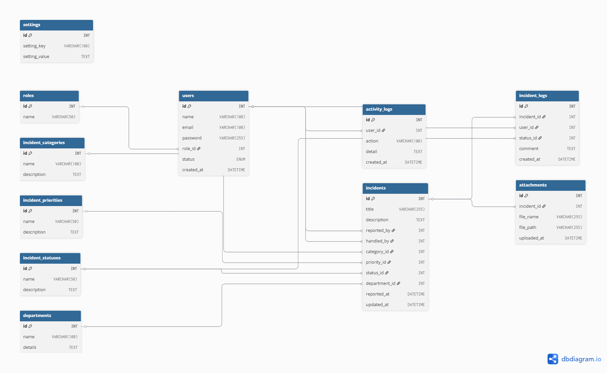

# 🛡️ INSIDENTIA – Sistem Pelaporan Insiden
## 🌐 Demo & Hosting

- 📽️ [Video Presentasi](https://youtu.be/9dxe7OgX1wQ?si=o6GF1r6erUwCTj0T)
- 🖥️ [Live Hosting](https://lutfimulia.mangaverse.my.id)

<div align="center">
  
  <h3>Sistem Manajemen Insiden Terpadu</h3>
  <p><strong>Efisien • Professional • Aman</strong></p>
</div>

---

## 📋 Deskripsi Singkat

**Insidentia** adalah aplikasi web modern untuk mengelola pelaporan dan penanganan insiden dengan fitur lengkap CRUD, reporting, dan dashboard analytics. Sistem ini dirancang untuk organisasi yang membutuhkan pengelolaan insiden yang terstruktur dan professional.

### 🚀 Teknologi yang Digunakan

- **Frontend**: HTML5, CSS3, Bootstrap 5.3, Chart.js
- **Backend**: PHP Native (≥ 7.4)
- **Database**: MySQL/MariaDB (≥ 5.7)
- **PDF Library**: TCPDF untuk laporan professional
- **Authentication**: Session-based dengan role management

## ✨ Fitur Utama

### 👨‍💼 Untuk Administrator
- **Dashboard Analytics** dengan chart dan statistik real-time
- **Manajemen Pengguna** lengkap dengan role-based access
- **CRUD Master Data** (Kategori, Prioritas, Status, Lokasi)
- **Manajemen Insiden** dengan tracking dan assignment
- **Laporan PDF Professional** dengan TCPDF integration
- **Export Data** ke Excel/CSV format
- **Activity Logging** untuk audit trail

### 👤 Untuk User
- **Pelaporan Insiden** yang user-friendly
- **Tracking Status** insiden secara real-time
- **Upload Attachment** untuk dokumentasi
- **History Laporan** personal
- **Dashboard Personal** dengan statistik

## 🔐 Akun Demo

Untuk testing dan demonstrasi, gunakan akun berikut:

### Administrator
```
Email    : admin@insidentia.com
Password : admin123
Role     : Administrator
```

### User Biasa
```
Email    : user@insidentia.com
Password : user123
Role     : User
```

> **⚠️ Penting**: Ubah password default ini pada environment production!

## 📊 Fitur Laporan PDF

Sistem ini dilengkapi dengan fitur laporan PDF professional menggunakan TCPDF:

### 📋 Laporan Yang Tersedia
- **Laporan Ringkasan Insiden** berdasarkan status
- **Export ke PDF** dengan styling professional
- **Preview HTML** sebelum cetak
- **Export Excel/CSV** untuk analisis data

### 🎨 Fitur PDF
- Header dengan branding Insidentia
- Tabel dengan styling modern dan warna tema pink
- Summary box dengan informasi ringkas
- Kolom ranking dan keterangan status
- Area tanda tangan untuk dokumen resmi
- Catatan penting untuk keamanan dokumen
- Automatic page breaks
- Professional typography

### 📥 Cara Menggunakan
1. Masuk sebagai Administrator
2. Buka menu **Laporan** 
3. Klik **"Cetak PDF"** untuk download langsung
4. Klik **"Preview Laporan"** untuk melihat sebelum cetak
5. Klik **"Export Excel"** untuk mendapatkan file CSV

## 📁 Struktur Folder

```
Insidentia/
├── public/                     // Folder untuk file yang dapat diakses publik
│   ├── assets/                 // CSS, JS, Gambar, dll.
│   │   ├── css/
│   │   │   └── style.css
│   │   ├── js/
│   │   │   └── script.js
│   │   └── img/
│   │       ├── login2.jpg
│   │       ├── logo.png
│   │       └── welcome.jpg
│   └── index.php               // Halaman utama atau titik masuk aplikasi
│
├── sql/                        // Skrip database
│   ├── schema.sql              // Skrip untuk membuat tabel
│   └── data.sql                // Skrip untuk data awal (seperti admin, kategori default)
│
├── src/                        // Kode sumber aplikasi
│   ├── admin/                  // Halaman dan logika untuk admin
│   │   ├── dashboard.php
│   │   ├── incidents.php
│   │   └── ... (file admin lainnya seperti categories.php, users.php, dll.)
│   │
│   ├── assets/                 // Aset yang mungkin digunakan oleh framework (di luar public)
│   │
│   ├── auth/                   // Halaman dan logika otentikasi
│   │   ├── login.php
│   │   ├── logout.php
│   │   ├── register.php
│   │   └── ... (file terkait auth lainnya seperti forgot-password.php)
│   │
│   ├── debug/                  // Skrip atau alat untuk debugging
│   │   └── create_admin.php
│   │
│   ├── includes/               // File-file yang di-include atau dibutuhkan
│   │   ├── auth_check.php      // Pengecekan sesi dan peran pengguna
│   │   ├── config.php          // Konfigurasi database dan global
│   │   ├── functions.php       // Kumpulan fungsi helper
│   │   ├── header.php          // Bagian header HTML
│   │   └── footer.php          // Bagian footer HTML
│   │
│   └── user/                   // Halaman dan logika untuk pengguna biasa
│       ├── dashboard.php
│       ├── my_incidents.php
│       ├── report_incident.php
│       └── settings.php
│
├── app/                        // Kemungkinan folder ini untuk framework (seperti INSIDENTIA di gambar 2)
│   ├── Config/                 // Konfigurasi aplikasi
│   │   ├── App.php
│   │   └── Database.php
│   │
│   ├── Controllers/
│   │   └── BaseController.php
│   │
│   ├── Middleware/
│   ├── Models/
│   │   └── BaseModel.php
│   │
│   ├── Services/
│   ├── Utils/
│   ├── Views/                  // File tampilan (HTML/PHP)
│   │   ├── admin/
│   │   ├── auth/
│   │   ├── components/
│   │   ├── layouts/
│   │   └── user/
│   │
│   └── database/
│
├── database/                   // Folder lain untuk skrip database atau migrasi
│
├── storage/                    // Penyimpanan file (cache, logs, dll.)
│   ├── cache/
│   └── logs/
│
├── docs/                       // Dokumentasi proyek
│   ├── installation.md
│   ├── usage.md
│   └── ... (file dokumentasi lainnya seperti DATABASE_STRUCTURE.md)
│
└── README.md                   // Panduan singkat proyek
```

# 💾 Struktur Database

Proyek ini menggunakan beberapa tabel utama untuk mengelola data insiden, pengguna, dan konfigurasi sistem. Berikut adalah tabel-tabel utamanya beserta deskripsi singkat:

### Tabel-tabel Utama

| Nama Tabel            | Deskripsi                                                                                                                                                                  |
| :-------------------- | :------------------------------------------------------------------------------------------------------------------------------------------------------------------------- |
| `roles`               | Menyimpan daftar peran pengguna (misalnya: `admin`, `user`).                                                                                                               |
| `users`               | Berisi data pengguna seperti nama, email, password, dan `role_id` untuk mengidentifikasi peran mereka.                                                                     |
| `incident_categories` | Mengelola kategori insiden yang tersedia (misalnya: `Hardware`, `Software`, `Jaringan`).                                                                                   |
| `incident_priorities` | Mendefinisikan tingkat prioritas insiden (misalnya: `Low`, `Medium`, `High`).                                                                                              |
| `incident_statuses`   | Menyimpan status insiden saat ini (misalnya: `Open`, `In Progress`, `Resolved`, `Closed`).                                                                                 |
| `departments`         | Daftar lokasi atau departemen tempat insiden terjadi.                                                                                                                      |
| `incidents`           | Tabel inti yang berisi semua laporan insiden, termasuk detail seperti judul, deskripsi, `category_id`, `priority_id`, `status_id`, `department_id`, dan `user_id` pelapor. |
| `incident_logs`       | Mencatat riwayat setiap perubahan atau pembaruan pada sebuah insiden.                                                                                                      |
| `activity_logs`       | Menyimpan log aktivitas pengguna dalam aplikasi.                                                                                                                           |
| `attachments`         | Mengelola file pendukung atau lampiran yang diunggah untuk sebuah insiden.                                                                                                 |
| `settings`            | Berisi konfigurasi sistem yang dapat diatur oleh admin.                                                                                                                    |

# Incident Management System – ER Diagram

Proyek ini merupakan bagian dari pengembangan sistem manajemen insiden (Incident Management System) yang bertujuan untuk mencatat, mengelola, dan memantau laporan insiden dari pengguna dalam suatu organisasi. Desain ER Diagram ini dirancang untuk mendukung berbagai fitur seperti pelaporan insiden, log aktivitas, lampiran, hingga pengelolaan status dan prioritas insiden.

## 📊 Entity Relationship Diagram (ERD)

Berikut adalah diagram relasi database dari aplikasi ini:


### 🔐 `roles`

Menyimpan data peran pengguna dalam sistem (misal: Admin, Staff, User).

| Kolom | Tipe    | Keterangan  |
| ----- | ------- | ----------- |
| id    | int     | Primary Key |
| name  | varchar | Nama peran  |

### 👤 `users`

Berisi data pengguna sistem.

| Kolom      | Tipe     | Keterangan             |
| ---------- | -------- | ---------------------- |
| id         | int      | Primary Key            |
| name       | varchar  | Nama pengguna          |
| email      | varchar  | Unique, Email pengguna |
| password   | varchar  | Kata sandi terenkripsi |
| role_id    | int      | Foreign Key → roles.id |
| status     | enum     | Status aktif/inaktif   |
| created_at | datetime | Tanggal dibuat         |

### 🧭 `incident_categories`, `incident_priorities`, `incident_statuses`

Masing-masing menyimpan kategori, prioritas, dan status insiden.

| Kolom       | Tipe    | Keterangan        |
| ----------- | ------- | ----------------- |
| id          | int     | Primary Key       |
| name        | varchar | Nama              |
| description | text    | Penjelasan detail |

### 🏢 `departments`

Mewakili lokasi atau unit kerja terkait insiden.

| Kolom   | Tipe    | Keterangan       |
| ------- | ------- | ---------------- |
| id      | int     | Primary Key      |
| name    | varchar | Nama departemen  |
| details | text    | Informasi detail |

### 📄 `incidents`

Menyimpan laporan insiden.

| Kolom         | Tipe     | Keterangan                  |
| ------------- | -------- | --------------------------- |
| id            | int      | Primary Key                 |
| title         | varchar  | Judul insiden               |
| description   | text     | Deskripsi lengkap           |
| reported_by   | int      | FK → users.id (pelapor)     |
| handled_by    | int      | FK → users.id (penangan)    |
| category_id   | int      | FK → incident_categories.id |
| priority_id   | int      | FK → incident_priorities.id |
| status_id     | int      | FK → incident_statuses.id   |
| department_id | int      | FK → departments.id         |
| reported_at   | datetime | Tanggal laporan dibuat      |
| updated_at    | datetime | Tanggal terakhir diperbarui |

### 🧾 `incident_logs`

Mencatat riwayat perubahan status insiden.

| Kolom       | Tipe     | Keterangan                 |
| ----------- | -------- | -------------------------- |
| id          | int      | Primary Key                |
| incident_id | int      | FK → incidents.id          |
| user_id     | int      | FK → users.id              |
| status_id   | int      | FK → incident_statuses.id  |
| comment     | text     | Catatan/komentar perubahan |
| created_at  | datetime | Waktu log dibuat           |

### 📎 `attachments`

Berisi file yang dilampirkan pada insiden.

| Kolom       | Tipe     | Keterangan            |
| ----------- | -------- | --------------------- |
| id          | int      | Primary Key           |
| incident_id | int      | FK → incidents.id     |
| file_name   | varchar  | Nama file             |
| file_path   | varchar  | Path penyimpanan file |
| uploaded_at | datetime | Waktu file diunggah   |

### 📚 `activity_logs`

Mencatat semua aktivitas pengguna dalam sistem.

| Kolom      | Tipe     | Keterangan           |
| ---------- | -------- | -------------------- |
| id         | int      | Primary Key          |
| user_id    | int      | FK → users.id        |
| action     | varchar  | Jenis aksi dilakukan |
| detail     | text     | Penjelasan aksi      |
| created_at | datetime | Waktu aksi dicatat   |

### ⚙️ `settings`

Menyimpan konfigurasi umum sistem.

| Kolom         | Tipe    | Keterangan         |
| ------------- | ------- | ------------------ |
| id            | int     | Primary Key        |
| setting_key   | varchar | Unique Key Setting |
| setting_value | text    | Nilai setting      |

---

## 🛠️ Alat dan Teknologi

Proyek ini dibangun dan dikelola menggunakan kombinasi beberapa alat dan teknologi utama:

### Pengembangan & Database

- **Visual Studio Code (VS Code)**: Digunakan sebagai editor kode utama untuk pengembangan aplikasi.
- **XAMPP**: Lingkungan pengembangan web lokal yang mencakup server Apache, PHP, dan **MySQL/MariaDB**.
- **MySQL / MariaDB**: Sistem manajemen basis data relasional (RDBMS) yang digunakan untuk menyimpan data aplikasi.

### Dokumentasi & Visualisasi

- **dbdiagram.io**: Alat visualisasi online untuk membuat **ER (Entity-Relationship) Diagram** database dalam format **DBML**.

### Pengembangan & Database

- **Visual Studio Code (VS Code)**: Digunakan sebagai editor kode utama untuk pengembangan aplikasi.
- **XAMPP**: Lingkungan pengembangan web lokal yang mencakup server Apache, PHP, dan **MySQL/MariaDB**.
- **MySQL / MariaDB**: Sistem manajemen basis data relasional (RDBMS) yang digunakan untuk menyimpan data aplikasi.

### Dokumentasi & Visualisasi

- **dbdiagram.io**: Alat visualisasi online untuk membuat **ER (Entity-Relationship) Diagram** database dalam format **DBML**.

---

## 🔄 Relasi Antar Tabel (ERD)

Beberapa contoh relasi utama:

- `users` ↔ `incidents`: Satu pengguna bisa melaporkan atau menangani banyak insiden.
- `incidents` ↔ `incident_logs`: Setiap insiden bisa memiliki banyak log perubahan.
- `incidents` ↔ `attachments`: Setiap insiden bisa memiliki banyak lampiran.
- `users` ↔ `activity_logs`: Setiap pengguna bisa mencatat berbagai aktivitas.

---

## 🔐 Fitur Autentikasi

1. Login menggunakan username dan password.
2. Session PHP untuk proteksi halaman.
3. Logout akan menghancurkan session.
4. Proteksi halaman CRUD dan laporan berdasarkan peran pengguna.

---

## 🔧 Modul CRUD Admin:

Modul-modul ini memungkinkan administrator untuk mengelola data master dan insiden dalam sistem:

1. Manajemen Pengguna (admin/users.php): Tambah, Edit, Hapus, Lihat daftar pengguna.
2. Manajemen Kategori Insiden (admin/categories.php): Tambah, Edit, Hapus, Lihat daftar kategori.
3. Manajemen Prioritas (admin/priorities.php): Tambah, Edit, Hapus, Lihat daftar prioritas.
4. Manajemen Status (admin/statuses.php): Tambah, Edit, Hapus, Lihat daftar status.
5. Manajemen Lokasi/Departemen (admin/locations.php): Tambah, Edit, Hapus, Lihat daftar lokasi/departemen.
6. Manajemen Insiden (admin/incidents.php): Melihat semua insiden, mengubah status insiden.

---

## Setiap modul CRUD memiliki halaman untuk:

1. Tambah data baru
2. Edit data yang sudah ada
3. Hapus data
4. Melihat daftar data dalam format tabel (dilengkapi dengan Bootstrap dan potensi paginasi).

---

## ⚙️ Instalasi

### 📋 Persyaratan Sistem

- **PHP**: ≥ 7.4 (Recommended: 8.0+)
- **MySQL/MariaDB**: ≥ 5.7
- **Web Server**: Apache/Nginx
- **Extensions**: MySQLi, GD/Imagick (untuk TCPDF), Session
- **Memory**: Minimum 128MB
- **Disk Space**: ~50MB

### 🚀 Instalasi Cepat

#### 1. Download & Extract
```bash
# Clone repository
git clone https://github.com/username/insidentia.git
# Atau download ZIP dan extract ke htdocs/www
```

#### 2. Setup Database
```sql
-- Buat database baru
CREATE DATABASE insidentia_db;

-- Import schema
source sql/schema.sql;

-- Import data awal (optional)
source sql/data.sql;
```

#### 3. Konfigurasi
Edit file `src/includes/config.php`:
```php
<?php
define('DB_SERVER', 'localhost');
define('DB_USERNAME', 'root');
define('DB_PASSWORD', '');
define('DB_NAME', 'insidentia_db');
?>
```

#### 4. Set Permissions
```bash
# Untuk sistem Linux/macOS
chmod -R 755 storage/
chmod -R 755 public/assets/uploads/
```

#### 5. Akses Aplikasi
Buka browser dan kunjungi:
```
http://localhost/insidentia/src/
```

### 🔧 Konfigurasi Tambahan

#### TCPDF Setup (untuk PDF)
- TCPDF sudah included di `src/libs/TCPDF-main/`
- Pastikan PHP extension `GD` atau `Imagick` aktif
- Untuk custom font, edit `tcpdf_config.php`

#### File Upload
```php
// Di php.ini, pastikan:
upload_max_filesize = 10M
post_max_size = 10M
max_execution_time = 300
```

## 📘 Panduan Penggunaan

    - Login : Gunakan akun dari data.sql atau buat akun baru
    - Dashboard : Admin dan pengguna diarahkan ke dashboard masing-masing
    - Admin : Akses manajemen pengguna, insiden, dan laporan, lihat grafik & statistik insiden
    - Pengguna : Laporkan insiden, Lihat riwayat laporan, Kelola akun pribadi
    - Logout : Gunakan tombol logout untuk keluar dari sistem dengan aman

## 📣 Penutup

Inisidentia adalah solusi pelaporan insiden yang dirancang untuk efisiensi, keteraturan, dan kemudahan penggunaan. Aplikasi ini bertujuan untuk menyederhanakan proses pelaporan, pelacakan, dan pengelolaan insiden di berbagai organisasi atau instansi. Dengan struktur yang terorganisir, Inisidentia dibuat agar mudah disesuaikan dan diintegrasikan, menjadikannya pilihan yang andal untuk kebutuhan manajemen insiden.

---

## 📝 Lisensi

Proyek ini dirilis di bawah lisensi MIT.
Hak Cipta (c) 2024 Lutfi Mulia
